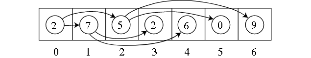
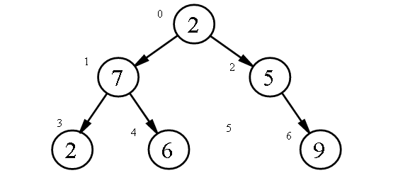

## How to solve this challenge?

1. Read the "Challenge description" below.
2. Make changes to the [challenge.js](./challenge.js) file.
3. Commit your changes.
4. Wait for the result of the "GitHub Classroom Workflow" action. If it is green - congratulations, you solved this challenge! If not - try again!
5.  *You can watch an example of how to solve a challenge in the video linked in the theoretical lesson preceding this challenge.*


## Challenge description

### A Tree in an Array

To store a Binary Tree in an Array, we just need to determine the order  that we store the Nodes in. A good order is "breadth-first" where we  store the items in order top-down and left-to-right of the tree.

Here's a tree represented as an array:



And this is the tree 'unfolded':



Notice that 5 only has one child Node, so the other child is represented as 0 in the above array. This is OK as long as we don't need to store  actual 0 values.

#### Challenge

The input for this challenge will provide an array of numbers in the above "breadth-first" format, and use 0's for non-nodes. 
Can you print out the sum of the Leftmost side of the Tree?

*Tip:* A number located at position i in an array will have it's left child located at the position 2i+1 in the array. 

#### Test case example:
```
leftmostNodesSum([2, 7, 5, 2, 6, 0, 9])
// => 11
```

Go down the left-hand side of the tree to get the sum: 2+7+2 = 11. You can take a look at the image of the tree above.

### Troubleshooting

If you cannot see any auto-grading workflows on the [Actions](../../actions) page, learn how to fix it in [this repo](https://github.com/microverse-students/autograding-troubles-js/blob/main/README.md).